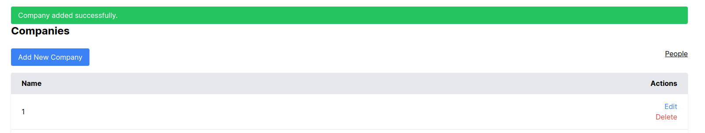

# README

This README would normally document whatever steps are necessary to get the
application up and running.

Things you may want to cover:

* Ruby version

* System dependencies

* Configuration

* Database creation

* Database initialization

* How to run the test suite

* Services (job queues, cache servers, search engines, etc.)

* Deployment instructions

* ...

# Spec

1. Rails 8.0
2. PostgreSQL
3. TailwindCss
4. Turbo
5. karminari

# How to run

```
rails db:create
rails db:migrate
rails db:seed_fu

rails s
```

# Results



